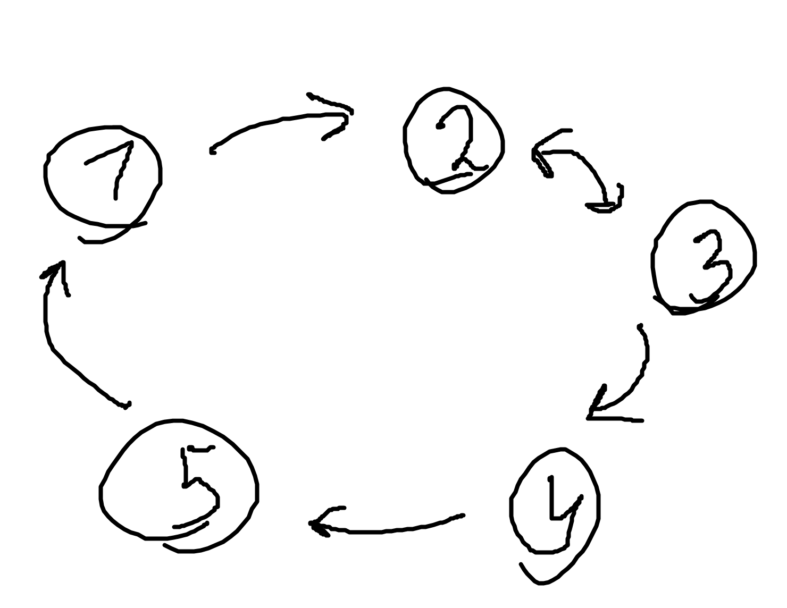

---  
layout: mathjax  
---  
  
# 35. Нормальные подгруппы. Факторгруппа.  
  
# вот это па па поворот меня ужалил пчелобав урод  
  
### *Определение. Нормальная группа.*  
Рассмотрим $H \subset G$ подгруппа называется нормальной, если  
$\forall h \in H, g \in G: ghg^{-1} \in H$.  
  
### **Пример.**  
  
### Группа обратимых матриц с матричным умножением, ее подгруппа - множество обратимых матриц с определителем равным 1.  
  
### Теорема. Следующие утверждения равносильны:  
$1)$ $H$ нормальная подгруппа $G$.  
$2)$ $\forall g \in G: gH = Hg$.  
$3)$ $\forall g \in G: gHg^{-1} = H$.  
$4)$ $\forall g \in G: gH \subset Hg$.  
$5)$ $\forall g \in G:Hg \subset gH$.  
  
### Схема доказательства представляет из себя следующий натюрморт:  
  
  
  
### $\LARGEну~погнали$👿  
$1) ⇒ 2)$:  
$gHg^{-1} \subset H$  
$$\begin{cases}  
gHg^{-1} * g \subset H * g \Rightarrow gH \subset Hg  
\\  
g * g^{-1}Hg\subset g * H \Rightarrow Hg \subset gH  
\end{cases}\Rightarrow gH=Hg ~~ \tiny\blacksquare$$  
  
$2) ⇒ 3)$ и $3) ⇒ 2)$ очевидны (домножаем на обратный)  
  
$3) ⇒ 4)$:  
Так как $\forall g \in G  \ gHg^{-1} = H$, то $gH = Hg$, а значит $gH \subset Hg ~~ \tiny\blacksquare$  
  
$4) ⇒ 5)$:  
$\forall g \in G  ~~  gH \subset Hg\Rightarrow g^{-1}H \subset Hg^{-1}$  
$gg^{-1}Hg \subset gHg^{-1}g\Rightarrow Hg \subset gH ~~ \tiny\blacksquare$  
  
$5) ⇒ 1)$:  
$Hg \subset gH$  
$g^{-1}H g \subset g^{-1}g H \Rightarrow g^{-1} H g \subset H \Rightarrow gHg^{-1} \subset H \ \  \forall g ~~ \tiny\blacksquare$  
  
### *Определение. Фактор группа.*  
Пусть $G$ $-$ группа, а $H~-$ нормальная подгруппа $G$.  
Тогда смежные классы образуют группу со следующими свойствами:  
$1)~g_1H * g_2H = g_1g_2H$  
$2)~(gH)^{-1}=g^{-1}H$  
Такую группу называют фактор группой $G$ по $H$ и обозначают как $G/_H$.  
  
### Проверка свойств.  
  
### $1)$ Возьмём $g_1H,g_2H\in G/_H$ и $g_1h_1\in g_1H,g_2h_2\in g_2H$.  
Чтобы доказать $g_1H * g_2H=g_1g_2H$, достаточно $g_1h_1g_2h_2\in g_1g_2H$.  
$g_1h_1g_2h_2=g_1g_2(g_2^{-1}h_1g_2)h_2$, но, так как $h=g_2^{-1}h_1g_2\in H$ ввиду нормальности подгруппы $H$, то $g_1h_1g_2h_2=g_1g_2hh_2\in g_1g_2H ~~ \tiny\blacksquare$  
  
$2)$ Рассмотрим $(gh)^{-1}\in(gH)^{-1}$.  
$(gh)^{-1}=h^{-1}g^{-1} =g^{-1}(gh^{-1}g^{-1}) = g^{-1}\overline{h} \in g^{-1}H  ~~ \scriptsize\blacksquare$  
  
### Примечание. $(gh)^{-1}=h^{-1}g^{-1}$  
  
### Доказательство:  
$(gh) * (gh)^{-1} = e \\ (gh) *  h^{-1}g^{-1} = e$  
ну а тут очев  
