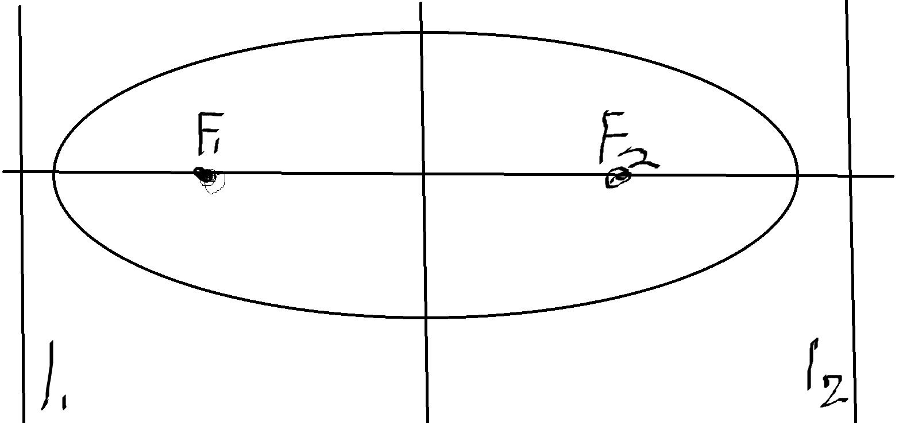
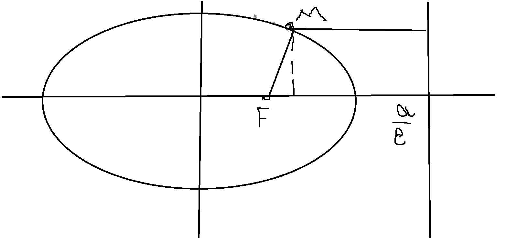

---  
layout: mathjax  
---  
  
# 16. Эллипс, равносильные определения.  
  
### Определение. Эллипс.  
$1)~F_1, F_2 ~-~$точки на плоскости,  
$F_1F_2 =2c$ , где $c~-~$константа  
Геометрическое место точек (ГМТ) $M:F_1M+F_2M = 2a,  ~~ a>c$  называется эллипсом.  
$2)~l~-$  прямая, $F~-~$ точка, $е~-$ константа ($0 \le e < 1$)  
ГМТ $M:\dfrac{FM}{\rho(M,l)}=e<1$ называется эллипсом.  
$3)$ В подходящих координатах эллипс задаётся уравнением:  
$( * )~\dfrac{x^2}{a^2}+\dfrac{y^2}{b^2}=1$, то есть существует система координат и  
$a,b\in\mathbb{R}:a,b\ne0$, такие что кривая задаётся уравнением $( * )$.  
  
### Свойства эллипса.  
$F_1~(-c;0),F_2~(c;0)~-~$фокусы эллипса.  
$a~-~$большая полуось, $b~-~$малая полуось.  
$a^2 = b^2 + c^2;  ~~  b<a, c<a  ~~  ( * )$  
  
### $( * )$ можно доказать, рассмотрев прямоугольный треугольник с вершинами в верхней точке эллипса, в пересечении координат и в одном из фокусов.  
  
### $e = \dfrac{c}{a}$ - эксцентриситет  
$l_1, l_2$ - директрисы уравнение $x = \pm \dfrac{a}{e}$  
  
  
  
### Данными свойствами можно пользоваться, так как все введенные буквы можно получить из определений и соотношения $( * )$.  
  
### Для первого определения известны $a$ и $c$ по формуле найдем $b$. Все остальные буквы исходят из определений.  
  
### Для второго определения дана прямая (директриса) и точка (фокус). Пусть $d= \dfrac{a}{e}-c$ - расстояние от директрисы до фокуса.  
Поделим все на $c$, помня что $\dfrac{a}{c}=\dfrac{1}{e}:$  
$\dfrac{d}{c}=\dfrac{1}{e^2}-1 \Rightarrow c = \dfrac{d}{\dfrac{1}{e^2}-1}$  
далее зная $c$ и $e$ мы выражаем все, что хотим.  
  
### Для третьего определения очевидно можем по $( * )$ вывести $c$ и узнать все остальное.  
  
### *Теорема. Определения $1),2),3)$ равносильны.*  
  
### Доказательство:  
$1)\Leftrightarrow3):$  Возьмем произвольную точку $M$$(x,y)$ на эллипсе в смысле определения $1$.  
$F_1M+F_2M=2a$  
$\sqrt{(x+c)^2+y^2} + \sqrt{(x-c)^2+y^2} =2a$ $( * )$  
$\sqrt{(x+c)^2+y^2}=2a  - \sqrt{(x-c)^2+y^2}$  возведем в квадрат  
$x^2 + 2cx + c^2 + y^2 = 4a^2 + x^2 - 2cx + c^2 + y^2 - 4a\sqrt{(x-c)^2 + y^2}$  
$a\sqrt{(x-c)^2+y^2}= a^2-cx$ поделим на а  
$\sqrt{(x-c)^2 + y^2} = a -ex$  
Возведём в квадрат. И вспомним, что $e=\dfrac{c}{a}\Rightarrow c=ae$.  
$x^2-2cx+c^2+y^2=a^2-2aex + e^2x^2$  
$x^2(1-e^2) + y^2 = a^2 - c^2=b^2$ поделим на $b^2$  
$\dfrac{x^2}{b^2}(\dfrac{a^2-c^2}{a^2})+\dfrac{y^2}{b^2}=1\Rightarrow \dfrac{x^2}{a^2} + \dfrac{y^2}{b^2}=1$  
  
### Тут важно, что при возведении в квадрат $x$ везде не превосходит $a$ и при возведении все выражения положительны. Таким образом, все преобразования равносильны  $\tiny\blacksquare$  
  
### $2)\Leftrightarrow3):$  
$\dfrac{x^2}{a^2} + \dfrac{y^2}{b^2}=1 \Leftrightarrow  \sqrt{(x-c)^2 + y^2} = a -ex = F_1M$  
  
  
  
### $p(M;l) = \dfrac{a}{e}-x = \dfrac{1}{e}(a-ex)$  
Тогда $\dfrac{a-ex}{\dfrac{a}{e}-x}=e\Rightarrow2)\Leftrightarrow3)$  $\tiny\blacksquare$  
  
## сидят два студента на крыльце химфака, пьют метанол. один другому говорит: пора закругляться, что то уже темнеет  
