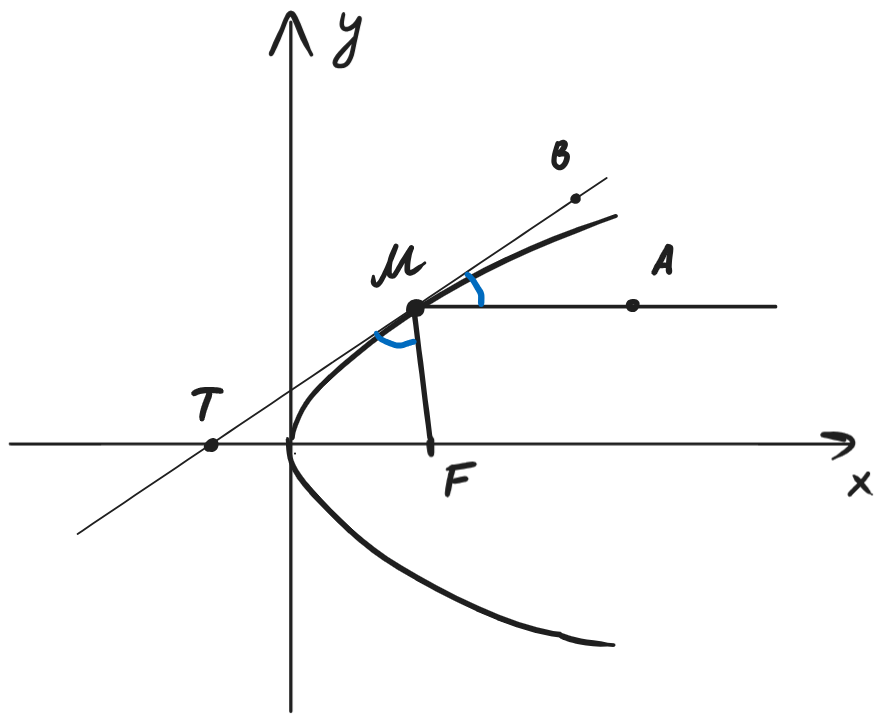

---  
layout: mathjax  
---  
  
# 24. Касательные к параболе. Оптическое свойство параболы.  
  
### *Теорема. Касательная к параболе.*  
Пусть $(x_0, y_0)~-~$точка на параболе $y^2=2px$.  
Тогда касательная имеет вид: $y_0y=p(x+x_0)$.  
  
### Доказательство:  
Проверим, что $y_0y=p(x+x_0)~-~$касательная в т. $(x_0;y_0)$.  
$\begin{cases}  
y_0y=p(x+x_0)  
\\  
y^2=2px  
\end{cases}  
\Rightarrow  
\begin{cases}  
px=y_0y-px_0  
\\  
y^2=2px  
\end{cases}$.  
$y^2=2y_0y-2px_0=2y_0y-y_0^2\Rightarrow(y-y_0)^2=0\Rightarrow y=y_0$.  
То есть это уравнение имеет единственное решение  $\scriptsize\blacksquare$  
  
### *Теорема. Оптическое свойство параболы.*  
Луч, выпущенный из фокуса, отражается от параболы и становится параллельным оси $Ox$.  
Тогда касательная к параболе образует равные углы с $Ox$ и фокальным радиусом $FM$.  
  
  
  
### Доказательство:  
Пусть $F~(\dfrac{p}{2};0)~-~$фокус параболы, а точка $M~(x_0;y_0)~-~$произвольная точка на параболе. Пусть луч $FM$, отражаясь от параболы переходит в луч $MA$, параллельный $Ox$, а точка $T~-~$точка пересечения $Ox$ с касательной, проведённой к параболе в точке $M$.  
Тогда из уравнения касательной в точке $M$: $y_0y=p(x+x_0)$ получим, что касательная пересекает $Ox$ в точке $(-x_0;0)$.  
Значит $TF=x_0+\dfrac{p}{2}$, а $MF=\rho(M,~директриса)=x_0+\dfrac{p}{2}$.  
Тогда получаем, что $\Delta TMF~-~$равнобедренный треугольник.  
Следовательно, $\angle MTF=\angle TMF$, но $\angle MTF=\angle BMA$ как соответственные при параллельных прямых.  
Значит $\angle TMF=\angle BMA ~~ \scriptsize\blacksquare$  
