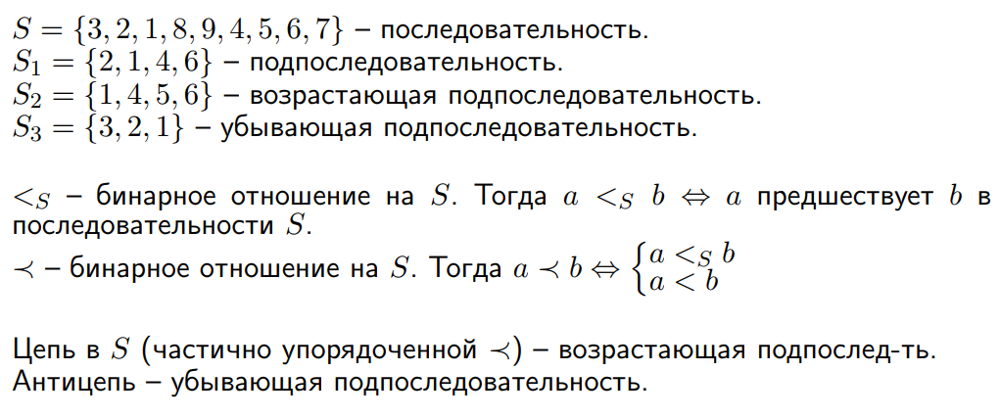

---  
layout: mathjax  
---  
  
# 6. Задача о построении наибольшей возрастающей подпоследовательности.  
  
### Немного про последовательности.  
  
  
  
### Построение возрастающей последовательности наибольшей длины.  
Алгоритм:  
Построим разбиение $\Lambda$ последовательности $A$ на антицепи $\Lambda_i$ (убывающие подпоследовательности, так как отношение $\prec$)  
следующим образом: проходя по последовательности слева направо, будем добавлять каждый следующий элемент последовательности в минимальный по номеру элемент разбиения, в который можем.  
  
Далее построим цепь (возрастающую последовательность).  
Пусть $h:=|\Lambda|$. Из алгоритма построения можно понять, что  
$\forall i\in2:h  ~~  \forall a\in \Lambda_i  ~~  \exists prev(a)\in\Lambda_{i-1}:prev(a)\prec a$, иначе $a$ попал бы в $\Lambda_{i-1}$. Зная это, построим цепь $B:|B|=h$, нумеруя с единицы:  
$B[h]\in\Lambda_h~-~$последний элемент цепи является произвольным элементом из последней антицепи.  
$B[i]=prev(B[i+1])$, где $i\in1:(h-1)$.  
Мы смогли построить цепь длины $h$. Тогда по утверждению из 5 вопроса мы можем разбить наше множество на $\ge h$ антицепей (так как не знаем, является ли $h$ высотой множества), а значит разбиние на антицепи $\Lambda$ минимально.  
Так как разбиение на антицепи $\Lambda$  минимально, то цепи длины $>h$ быть не может, иначе, какие-то 2 элемента, принадлежащие $\Lambda_i$, находятся в отношении $?!$ с тем, что $\Lambda_i~-~$антицепь $\Rightarrow$ $B~-~$максимальная цепь  $\scriptsize\blacksquare$  
  
### Примечание. Это происходит из-за того, что элементы одной цепи должны оказаться в разных антицепях.  
  
### Пример.  
  
### $A=\\{3,5,8,9,4,6,1,2,7,10\\}$  
$1.$ $\Lambda=\\{\\{3\\}\\}$  
$2.$ $\Lambda=\\{\\{3\\}, \\{5\\}\\}$  
$3.$ $\Lambda=\\{\\{3\\}, \\{5\\}, \\{8\\}\\}$  
$4.$ $\Lambda=\\{\\{3\\}, \\{5\\}, \\{8\\}, \\{9\\}\\}$  
$5.$ $\Lambda=\\{\\{3\\}, \\{5, 4\\}, \\{8\\}, \\{9\\}\\}$  
$6.$ $\Lambda=\\{\\{3\\}, \\{5, 4\\}, \\{8, 6\\}, \\{9\\}\\}$  
$7.$ $\Lambda=\\{\\{3, 1\\}, \\{5, 4\\}, \\{8, 6\\}, \\{9\\}\\}$  
$8.$ $\Lambda=\\{\\{3, 1\\}, \\{5, 4, 2\\}, \\{8, 6\\}, \\{9\\}\\}$  
$9.$ $\Lambda=\\{\\{3, 1\\}, \\{5, 4, 2\\}, \\{8, 6\\}, \\{9, 7\\}\\}$  
$10.$ $\Lambda=\\{\\{3, 1\\}, \\{5, 4, 2\\}, \\{8, 6\\}, \\{9, 7\\}, \\{10\\}\\}$  
Тогда наибольшая возрастающая последовательность:  
$B=\\{3, 5, 6, 7, 10\\}$ или $\\{3, 5, 8, 9, 10\\}$  
