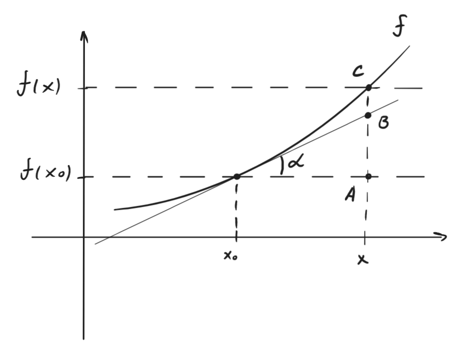
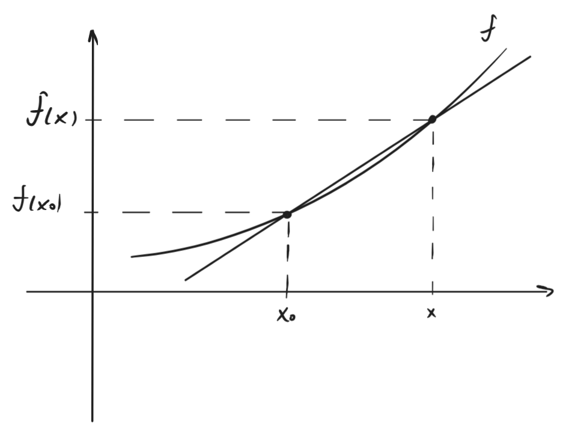

---  
layout: mathjax  
---  
  
# 45. Касательная к графику функции. Геометрический смысл касательной, производной, дифференциала.  
  
### *Определение. Касательная к графику функции.  
$f$* определена в $u(x_0)$ и $\exists$ конечная или равная $\pm \infty$ производная $f'(x_0)$ Тогда прямая, задаваемая уравнением:  
$\begin{cases}  
   f(x)=f'(x_0)(x-x_0)+f(x_0) & f'(x_0) -конечна \\  
   x=x_0 & f'(x_0)=\pm \infty  
\end{cases}$  
называется касательной функции в точке $x_0$.  
  
### $AB=f'(x_0)*\Delta x=df(x_0)$, так как в точке $B$ значение прямой $f'(x_0)\Delta x + f(x_0)$ из уравнения выше.  
$\tg \alpha = \dfrac{AB}{\Delta x}\Rightarrow AB=\tg \alpha*\Delta x$  
Тогда $f'(x_0)=\tg\alpha$.  
  
$AC=\Delta f(x_0)$.  
$BC=AC-AB=  
\Delta f(x_0)-f'(x_0)\Delta x  
=\\=\Delta f(x_0)-df(x_0, \Delta x) = \mathring{o}(\Delta x)$  
  
  
  
### $\dfrac{f(x)-f(x_0)}{x-x_0}~-~$угловой коэф. секущей.  
  
### $\lim\limits_{x\to x_0}\dfrac{f(x)-f(x_0)}{x-x_0}=f'(x_0)~-~$угловой коэффициент касательной.  
  
  
