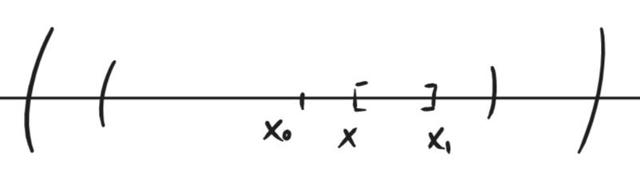

---  
layout: mathjax  
---  
  
# 57. Правило Лопиталя для бесконечно больших.  
  
### *Теорема. Правило Лопиталя для бесконечно больших.*  
Если $x_0\in\overline{\mathbb{R}}; f,g$ дифференцируемы в $\mathring{u}(x_0)$; $g'(x_0)\ne0$ в этой окрестности и существуют пределы:  
$\lim\limits_{x\to x_0}g(x)=+\infty;\lim\limits_{x\to x_0}\dfrac{f'(x)}{g'(x)}=A\in\overline{\mathbb{R}}$  
Тогда $\lim\limits_{x\to x_0}\dfrac{f(x)}{g(x)}=A$  
  
### *Доказательство:*  
1) $A=0.$  
Зафиксируем общий $\varepsilon >0$.  
Так как $\lim\limits_{x\to x_0}g(x)=+\infty$, то $\exists u_1(x_0):\forall x\in \mathring{u_1}(x_0) ~~ g(x)>0$  
  
### *Примечание: важно, что $g(x)\ne0$ в этой окрестности, так как мы хотим поделить на него в будущем.*  
  
### Так как $\lim\limits_{x\to x_0}\dfrac{f'(x)}{g'(x)}=A=0$, то $\exists u_2(x_0):\forall x\in\mathring{u_2}(x_0) ~~ \Big|\dfrac{f'(x_0)}{g'(x_0)}\Big|<\varepsilon$  
  
### Возьмём $x_1\in \mathring{u_1}\cap\mathring{u_2}$ и  
$x:x_0\lessgtr x\lessgtr x_1$  
  
  
  
### $\dfrac{f(x)}{g(x)}=\dfrac{(f(x)-f(x_1))*(g(x)-g(x_1))}{(g(x)-g(x_1))*g(x)}+\dfrac{f(x_1)}{g(x)}$  
Попробуем оценить получившееся выражение.  
По теореме Коши для отрезка $[x;x_1]$:  
 $\exists c\in(x;x_1):\dfrac{f(x)-f(x_1)}{g(x)-g(x_1)}=\dfrac{f'(c)}{g'(c)}$  
Тогда, так как $c\in\mathring{u_2}$, то $\Big|\dfrac{f(x)-f(x_1)}{g(x)-g(x_1)}\Big|=\Big|\dfrac{f'(c)}{g'(c)}\Big|<\varepsilon$  
  
### *Примечание: мы можем применить теорему Коши, так как функции дифференцируемы на этом отрезке (отрезок внутри окрестности).*  
  
### Рассмотрим предел: $\lim\limits_{x\to x_0}\dfrac{g(x)-g(x_1)}{g(x)}=\lim\limits_{x\to x_0}\Big(1-\dfrac{g(x_1)}{g(x)}\Big)=1$  
(так как $g(x_1)~-~$конечное число, а $g(x)\to+\infty$).  
Тогда по свойству локальной ограниченности функции, имеющей конечный предел, $\exists\mathring{u_3}(x_0):\forall x\in\mathring{u_3}(x_0) ~~ \Big|\dfrac{g(x)-g(x_1)}{g(x)}\Big|<1+\varepsilon$  
  
### Рассмотрим ещё один предел: $\lim\limits_{x\to x_0}\dfrac{f(x_1)}{g(x)}=0$  
(так как $f(x_1)~-~$конечное число)  
Тогда $\exists \mathring{u_4}(x_0):\forall x\in\mathring{u_4}(x_0) ~~ \Big|\dfrac{f(x_1)}{g(x)}\Big|<\varepsilon$  
Собираем оценки:  
$\forall x\in \mathring{u_1}\cap\mathring{u_2}\cap\mathring{u_3}\cap\mathring{u_4}\cap(x_0-|x_0-x_1|;x_0+|x_0-x_1|)$  
  
### *Примечание: насколько я понимаю, последний интервал нужен для того, чтобы в пересечение точно входили $x$ и $c$.*  
  
### $\Big|\dfrac{f(x)}{g(x)}\Big|=\Big|\dfrac{(f(x)-f(x_1))*(g(x)-g(x_1))}{(g(x)-g(x_1))*g(x)}+\dfrac{f(x_1)}{g(x)}\Big|<\\<(1+\varepsilon)*\varepsilon+\varepsilon \Rightarrow\lim\limits_{x\to x_0}\dfrac{f(x)}{g(x)}=A=0 ~~ \scriptsize\blacksquare$  
  
### 2) $A\ne0. ~A\in\mathbb{R}.$  
Рассмотрим функцию $h(x)=f(x)-A * g(x)$.  
Она дифференцируема на $\mathring{u}(x_0):h'(x)=f'(x)-A * g'(x)$.  
$\lim\limits_{x\to x_0}\dfrac{h'(x)}{g'(x)}=\lim\limits_{x\to x_0}\dfrac{f'(x)-A * g'(x)}{g'(x)}=\lim\limits_{x\to x_0}\Big(\dfrac{f'(x)}{g'(x)}-A\Big)=0$  
Тогда по первому пункту:  
$\lim\limits_{x\to x_0}\dfrac{h(x)}{g(x)}=0=\lim\limits_{x\to x_0}\Big(\dfrac{f(x)}{g(x)}-A\Big)=\lim\limits_{x\to x_0}\dfrac{f(x)}{g(x)}-A=0$  
Значит $\lim\limits_{x\to x_0}\dfrac{f(x)}{g(x)}=A ~~ \scriptsize \blacksquare$  
  
### 3) $A=+\infty$  
Зафиксируем общий $E$.  
Так как $\lim\limits_{x\to x_0}g(x)=+\infty$, то $\exists u_1(x_0):\forall x\in \mathring{u_1}(x_0) ~~ g(x)>0$  
Так как $\lim\limits_{x\to x_0}\dfrac{f'(x)}{g'(x)}=+\infty$, то $\exists u_2(x_0):\forall x\in\mathring{u_2}(x_0) ~~ \dfrac{f'(x)}{g'(x)}>E$  
  
### Возьмём $x_1\in \mathring{u_1}\cap\mathring{u_2}$ и  
$x:x_0\lessgtr x\lessgtr x_1$  
  
  
  
### Как в доказательстве для нуля оценим выражение:  
$\dfrac{f(x)}{g(x)}=\dfrac{(f(x)-f(x_1))*(g(x)-g(x_1))}{(g(x)-g(x_1))*g(x)}+\dfrac{f(x_1)}{g(x)}$  
Тогда по теореме Коши для отрезка $[x;x_1]$:  
$\exists c: x<c<x_1:\dfrac{f(x_1)-f(x_1)}{g(x)-g(x_1)}=\dfrac{f'(c)}{g'(c)}>E$  
  
$\dfrac{g(x)-g(x_1)}{g(x)}\to 1\Rightarrow$  в некоторой окрестности $u_3(x_0)$ дробь больше любого числа меньше $1$, например $\dfrac{3}{4}$.  
  
$\dfrac{f(x_1)}{g(x)}\to0\Rightarrow$ в $u_4(x_0)$ дробь больше любого отрицательного числа, например $-\dfrac{E}{4}$ (всё, что угодно, чтобы оценка осталась разумной).  
  
$\dfrac{f(x)}{g(x)}>E\cdot\dfrac{3}{4}-\dfrac{E}{4}=\dfrac{E}{2} ~~ \forall E$ в пересечении всех проколотых окрестностей  $\scriptsize\blacksquare$  
