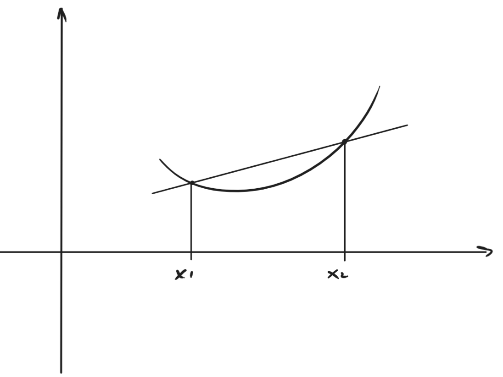
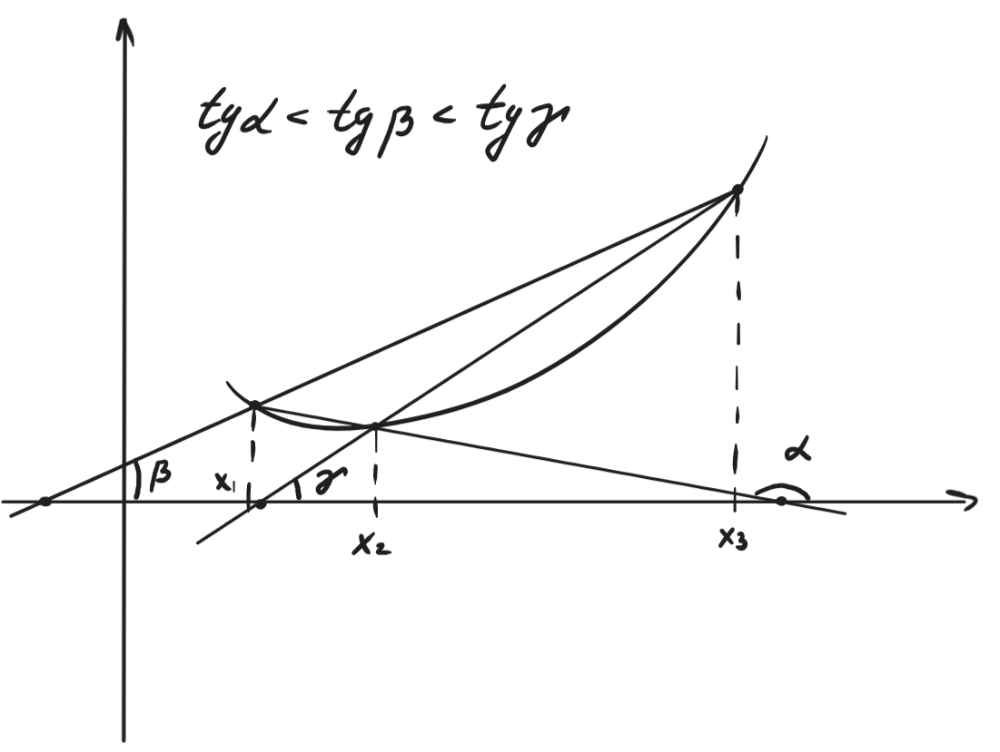

---  
layout: mathjax  
---  
  
# 68. Выпуклые/вогнутые функции. Лемма о трёх хордах.  
  
### *Определение. Выпуклые/вогнутые функции.*  
$f$ определена на $<a;b>$. Если $\forall x_1, x_2\in <a;b>~\forall\lambda\in(0;1)$ выполняется: $f\big(\lambda x_1+(1-\lambda)x_2\big)\le (\ge)~f(x_1)\lambda+(1-\lambda)f(x_2)$, то функцию $f$ называют выпуклой (вогнутой) на $<a;b>$.  
Если $x_1\ne x_2$ и знак неравенства строгий, то $f$ называется строго выпуклой (вогнутой).  
  
### *Замечание.*  
Иногда выпуклую (вогнутую) называют выпуклой вниз (вверх).  
  
### *Замечание.*  
Если заменить $x_1$ на $x_2$, то определение не измениться ($\lambda$ просто изменится на $1-\lambda$). Далее будем считать, что $x_1<x_2$.  
  
### *Замечание.*  
$f$ выпукла $\Leftrightarrow$ $-f$ - вогнута. Далее будем рассматривать только выпуклые функции.  
  
### *Замечание.*  
Рассмотрим функцию $x(\lambda)=x=\lambda x_1 + (1-\lambda)x_2$.  
Так как $\lambda\in(0;1)$, то $x\in(x_1, x_2)$. Выразим $\lambda$ и $1-\lambda$:  
$\lambda=\dfrac{x-x_2}{x_1-x_2}\quad\quad\quad\quad\quad\quad\quad\quad\quad\quad\quad1-\lambda=\dfrac{x_1-x}{x_1-x_2}=\dfrac{x-x_1}{x_2-x_1}$  
Вернёмся к неравенству из определения:  
$f\big(\lambda x_1+(1-\lambda)x_2\big)\le ~f(x_1)\lambda+(1-\lambda)f(x_2)$  
$f(x)\le f(x_1)*\dfrac{x-x_2}{x_1-x_2}+f(x_2)*\dfrac{x-x_1}{x_2-x_1}$  
С правой стороны стоит уравнение прямой, проходящей через точки:  
$\big(x_1, f(x_1)\big)$ и $\big(x_2, f(x_2)\big)$.  
Значит $f$ - выпуклая $\Leftrightarrow$ график функции не выше хорды.  
  
  
  
### *Лемма о трёх хордах.*  
$f$ определена на $<a;b>$. Тогда следующие условия эквивалентны:  
1) Ф-я (строго) выпукла на $<a;b>$  
2) $\forall x_1, x_2, x_3\in~<a;b>$ и $x_1<x_2<x_3$.  
    Тогда $\dfrac{f(x_2)-f(x_1)}{x_2-x_1}\le(<)\dfrac{f(x_3)-f(x_1)}{x_3-x_1}\le(<)\dfrac{f(x_3)-f(x_2)}{x_3-x_2}$  
3) $\forall x_1, x_2, x_3\in~<a;b>$ и $x_1 < x_2 < x_3$  
    Тогда $\dfrac{f(x_2)-f(x_1)}{x_2-x_1}\le(<)\dfrac{f(x_3)-f(x_2)}{x_3-x_2}$  
  
  
  
### Доказательство: $1) \Rightarrow 2) \Rightarrow 3) \Rightarrow 1)$  
$1) \Rightarrow 2)$:  
Возьмём произвольные $x_1, x_2, x_3$ и выберем следующую $\lambda$:  
$\lambda:=\dfrac{x_2-x_3}{x_1-x_3}$ (выражали это выше, здесь роль $x$ играет $x_2$).  
Тогда $1-\lambda=\dfrac{x_1-x_2}{x_1-x_3}$  
Выразим $x_2$: $x_2=\lambda(x_1-x_3)+x_3=\lambda x_1 + (1-\lambda)x_3$  
$f\big(\lambda(x_1)+(1-\lambda)x_3\big)\le\lambda f(x_1)+(1-\lambda)f(x_3)$ (условие выпуклости)  
Подставим выраженный $x_2$:  
$f(x_2)\le\lambda f(x_1)+(1-\lambda)f(x_3)$ $( * )$  
a) Вычтем из обоих частей $( * )$ $f(x_3)$:  
$f(x_2)-f(x_3)\le\lambda\big(f(x_1)-f(x_3)\big)$  
$f(x_2)-f(x_3)\le\dfrac{x_2-x_3}{x_1-x_3}\big(f(x_1)-f(x_3)\big)$  
$\dfrac{f(x_2)-f(x_3)}{x_2-x_3}\ge\dfrac{f(x_1)-f(x_3)}{x_1-x_3}\Rightarrow\dfrac{f(x_3)-f(x_2)}{x_3-x_2}\ge\dfrac{f(x_3)-f(x_1)}{x_3-x_1}$  
b) Вычтем из обоих частей $( * )$ $f(x_1)$:  
$f(x_2)-f(x_1)\le(\lambda-1)f(x_1)+(1-\lambda)f(x_3)$  
$f(x_2)-f(x_1)\le(1-\lambda)\big(f(x_3)-f(x_1)\big)$  
$f(x_2)-f(x_1)\le\dfrac{x_1-x_2}{x_1-x_3}\big(f(x_3)-f(x_1)\big)$  
$\dfrac{f(x_2)-f(x_1)}{x_1-x_2}\ge\dfrac{f(x_3)-f(x_1)}{x_1-x_3}\Rightarrow\dfrac{f(x_2)-f(x_1)}{x_2-x_1}\le\dfrac{f(x_3)-f(x_1)}{x_3-x_1}$  
  
$2)\Rightarrow3)$: Очевидно из формулировок этих пунктов.  
  
$3)\Rightarrow1)$:  
Пусть $x_1<x_3$, а $\lambda\in(0;1)$.  
Определим $x_2:=\lambda x_1+(1-\lambda)x_3$.  
Тогда $\lambda=\dfrac{x_2-x_3}{x_1-x_3}=\dfrac{x_3-x_2}{x_3-x_1}$, а $1-\lambda=\dfrac{x_2-x_1}{x_3-x_1}$.  
Из пункта $3)$ имеем:  
$\dfrac{f(x_2)-f(x_1)}{x_2-x_1}\le\dfrac{f(x_3)-f(x_2)}{x_3-x_2}$.  
Поделим обе части на $\dfrac{1}{x_3-x_1}$:  
$\dfrac{f(x_2)-f(x_1)}{1-\lambda}\le\dfrac{f(x_3)-f(x_2)}{\lambda}$.  
Выразим $f(x_2)$:  
$\big(f(x_2)-f(x_1)\big)\lambda\le(1-\lambda)\big(f(x_3)-f(x_2)\big)$  
$\lambda f(x_2)+f(x_2)-\lambda f(x_2)\le\lambda f(x_1)+(1-\lambda)f(x_3)$  
$f(x_2)\le\lambda f(x_1)+(1-\lambda)f(x_3)$  
$f(\lambda x_1+(1-\lambda)x_3)\le\lambda f(x_1)+(1-\lambda)f(x_3) ~~ \scriptsize\blacksquare$  
