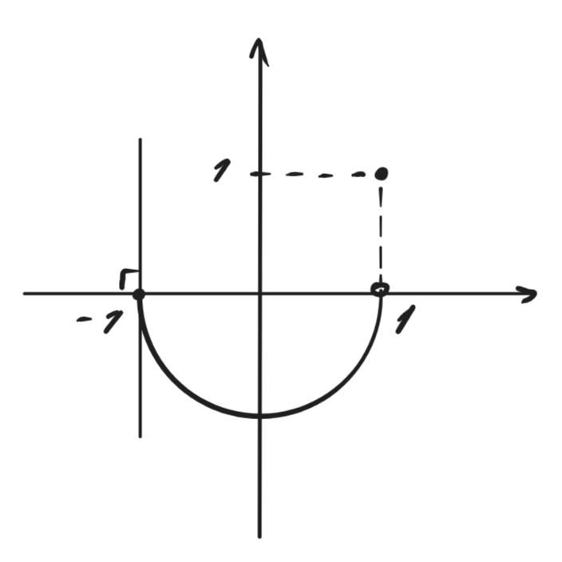

---  
layout: mathjax  
---  
  
# 69. Выпуклость и односторонние производные. Непрерывность выпуклой функции.  
  
### *Теорема. Производные выпуклой функции.*  
Если $f$ выпуклая на $<a;b>$, то $\forall x_0\in(a;b)$ существует конечная производная слева и справа и $f'_-(x_0)\le f'_+(x_0)$.  
  
### *Примечание: выпуклая функция не обязана быть дифференцируемой на всей области определения.*  
  
### Доказательство:  
Рассмотрим функцию $g(x):=\dfrac{f(x)-f(x_0)}{x-x_0}$. Из $2)$ теоремы о трёх хордах $g(x)\nearrow$ на всей области определения, т.е. на $<a;b>\setminus{\\{x_0\\} }$.  
Возьмём произвольные $x_1, x_2:a<x_1<x_0<x_2<b\Rightarrow\\\Rightarrow g(x_1)\le g(x_2)$  
На $<a;x_0)~g(x)$ ограничено сверху $g(x_2)$.  
На $(x_0;b>~g(x)$ ограничено снизу $g(x_1)$.  
Тогда по теореме о пределе монотонной функции существуют конечные пределы $g(x_0-0)$ при $x_1\to x_0-0$ и $g(x_0+0)$ при $x_2\to x_0+0$.  
Значит существуют односторонние производные $f'_-(x_0)$ и $f'_+(x_0)$.  
Вернёмся к неравенству $g(x_1)\le g(x_2)$ и перейдём к пределу:  
a) $x_1\to x_0-0$  
$f'_-(x_0)=\lim\limits_{x_1\to x_0-0}g(x_1)\le\lim\limits_{x_1\to x_0-0}g(x_2)=g(x_2)$  
b) $x_2\to x_0+0$  
$f'_-(x_0)\le g(x_2)$ из пункта a)  
$f'_-(x_0)=\lim\limits_{x_2\to x_0+0}f'_-(x_0)\le\lim\limits_{x_2\to x_0+0}g(x_2)=f'_+(x_0)$  
Тогда $f'_-(x_0)\le f'_+(x_0) ~~ \scriptsize\blacksquare$  
  
### *Следствие о непрерывности выпуклой функции.*  
Если $f$ выпукла на $<a;b>$, то она непрерывна на $(a;b)$.  
  
### Доказательство:  
Возьмём $x_0\in(a;b)$. Тогда есть конечные производные $f'_-(x_0)$ и $f'_+(x_0)$  
Значит функция непрерывна слева от точки $x_0$ и справа (дифференцируемость $\Rightarrow$ непрерывность), то есть предел справа равен значению функции, и предел слева равен значению функции. Следовательно, функция непрерывна  $\scriptsize\blacksquare$  
  
### Пример:  
$f(x)=\begin{cases}  
-\sqrt{1-x^2}&;~x\in[-1;1)  
\\  
1&;~x=1  
\end{cases}$  
  
### Эта функция тоже выпукла!  
В крайних точках производная может быть равна $\pm\infty$ или вовсе не существовать.  
  
  
