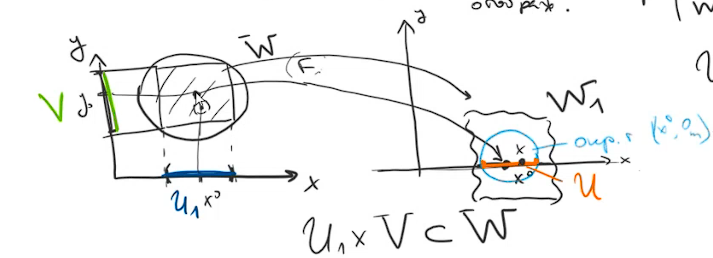
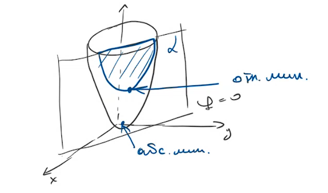

---  
layout: mathjax  
---  
  
# 14.05.24  
  
### Рассмотрим функцию $F(x,y)=0\lrArr y=f(x)$.  
Пример для одномерного случая: пусть $F(x,y)=x-y^2=0\lrArr y(x)=\pm\sqrt x$.  
$F$ дифференцируема в $(x^0,y^0):~$$\underbrace{F(x^0+\varDelta x,y^0+\varDelta y)}_{=0}=\underbrace{F(x^0,y^0)}_{=0}+F'_x(x^0,y^0)\varDelta x+F'_y(x^0,y^0)\varDelta y+o(\varDelta x,\varDelta y)$  
$F'_x(x^0,y^0)\varDelta x+F'_j(x^0,y^0)\varDelta y\thickapprox0$, $\varDelta y=y-y_0,~\varDelta x=x-x_0$  
Если $F'_y(x^0,y^0)\neq0,$ то $\displaystyle y\thickapprox y_0-\frac{F'_x(x^0,y^0)}{F'_y(x^0,y^0)}(x-x_0)~-~$уравнение касательной.  
$F'_y(x,y)=(x-y^2)'_y=-2y=0\lrArr y=0$.  
Рассмотрим многомерный случай:  
 $\begin{cases}  
\Phi_1(x_1\dots x_d,y_1\dots y_m)=0\\  
\dots\\  
\Phi_m(x_1\dots x_d,y_1\dots y_m)=0  
\end{cases}\overset{?}{\lrArr}\begin{cases}  
y_1=\phi_1(x_1\dots x_d)\\  
\dots\\  
y_m=\phi_m(x_1\dots x_d)  
\end{cases}$  
(то есть можно ли выразить $y$).  
Для краткости обозначим системы выше $\Phi(x,y)=0_m\lrArr y=\phi(x)$. $\Phi:D\subset R^{\dim}\to\mathbb{R}^m$.  
Возьмем точку $a(x^0,y^0)\in\mathbb{R}^{\dim}$.  
Рассмотрим матрицу Якоби $\Phi'\in L(l_2^{\dim},l_2^m)$.  
$\Phi'=\begin{pmatrix}  
(\Phi_1)'_{x_1}\dots(\Phi_1)'_{x_d} ~~ (\Phi_1)'_{y_1}\dots(\Phi_1)'_{y_m}\\  
\dots\\  
\underbrace{(\Phi_m)'_{x_1}\dots(\Phi_m)'_{x_d} }_{=\Phi'_x} ~~ \underbrace{(\Phi_m)'_{y_m}\dots(\Phi_1)'_{y_m} }_{=\Phi'_y}  
\end{pmatrix}$.  
$\Phi'_x(a)h=\Phi'(a)(h,0_m),~h\in\mathbb{R}^d$. $\Phi'_y(a)k=\Phi'(a)(0_d,k),~k\in\mathbb{R}^m$.  
  
### Теорема. Теорема о неявном отображении.  
$D$ открытое в $\mathbb{R}^{d+m}$, $\Phi\in C^1(D,\mathbb{R}^m),$ $(x^0,y^0)\in D,$ $\Phi(x^0,y^0)=0_m$, $\det\Phi'_y(x^0,y^0)\neq0$, тогда $\exists$ окрестности точек $x^0~U$ и $y^0~V,$ такие, что:  
$1)~\forall x\in U ~~ \exists!y\in V ~~ \Phi(x,y)=0_m,$ т.о. определено отображение  
$\phi:U\to V:~y\in\phi(x)\lrArr\phi(x,y)=0_m$,  
(говорят, что $\phi$ неявно задана системой уравнений $\phi(x,y)=0_m$)  
$2)~\phi\in C^1(U,V)$  
$3)~\phi'(x)=-(\Phi'_y(x,y))^{-1}\Phi'_x(x,y) ~~ \forall x\in U$  
  
### Доказательство:  
Рассмотрим вспомогательное отображение $F:D\subset\mathbb{R}^{d+m}\to\mathbb{R}^{d+m} ~~ F:((x_1\dots x_d,y_1\dots y_m)\to(x_1\dots x_d,\phi_1\dots\phi_m)$.  
Рассмотрим якобиан $F'=\begin{pmatrix}  
\overbrace{1~ 0\dots~0}^d&\overbrace{0}^m\rbrace d\\  
\dots\\  
0&0\dots&1\\  
\end{pmatrix}$,  
$\det F'=1*\det\Phi'_y\Rightarrow \det F'(x^0,y^0)=\det\Phi'_y(x^0,y^0)\neq0$, $F\in C^1(D,R^{d+m})\underset{\text{Т об обр отобр} }{\Rightarrow}\exists W=B_r(x^0,y^0)~-~$шар в $\mathbb{R}^{d+m}$,  
$F|_W$ обратимо. $F(x^0,y^0)=F(x^0,0_m)$  
  
  
  
### $U_1=B_{\frac{r}{\sqrt2} }(x^0)$, $V=B_{\frac{r}{\sqrt2} }(y^0)$.  
$U_1\times V\subset W$, докажем это.  
 $\displaystyle x\in U_1,~y\in V ~~ |(x,y)-(x^0,y^0)|=(\underbrace{\sum_{j=1}^{d}(x_j-x^0_j)^2}_{<\frac{r^2}{2} }+\underbrace{\sum_{j=1}^{m}(y_j-y^0_j)^2}_{\frac{r^2}{\sqrt2} })^\frac{1}{2}<r\Rightarrow (x,y)\in W$  
$W_1:=F(U_1\times V),~U_1\times V~-~$отображение $\underset{2)\text{Т об обр отобр} }{\Rightarrow}W_1$ открыто, и т.к. $(x^0,0_m)\in W_1\Rightarrow \exists$  $($окрестность точки $(x^0,0_m))\subset W_1\Rightarrow$ обозначим (окрестность точки $(x^0,0_m)$)$\cap\mathbb{R}^{d}=U~-~$окрестность $x^0$. Доказательство самих пунктов:  
$1)$ Пусть $x\in U$, тогда $(x,0_m)\in W_1=F(U_1\times V)\Rightarrow F^{-1}(x,0_m)\in U_1\times V\Rightarrow x\in U_1~\exists y\in V$ $\Phi(x,y)=0_m$. Докажем единственность $y$. Предположим противное, $\exists\overline{y}\in V ~~ \phi(x,\overline{y})=0_m,~(x,y),(x,\overline{y})\in W,~F(x,y)=(x,0_m)=F(x,\overline{y})$, т.к. $F$ обратима (она биекция), то $(x,y)=(x,\overline{y})\Rightarrow y=\overline{y}$.  
$2)$ $\phi:x\overset{Q}{\to}(x,0_m)\overset{F^{-1} }{\to}(x,y)\overset{P}{\to}y$. Получается, что $\phi=P\circ F^{-1}\circ Q;~Q,P~$линейны $\Rightarrow Q,P\in C^{\infty}$ и $~F^{-1}$ по теореме об обратном отображении $\in C^1\Rightarrow\phi\in C^1$  
$3)$ $\Phi(x,\phi(x))\equiv0_m$, продифференцируем это: $\Phi'(x,\phi(x))*E_{d\times d}+\Phi_y(x,\phi(x))*\phi'(x)=0_{m\times d}$ $\Phi'_y*\phi'=-\Phi'_x$, $\phi'=-(\Phi_y')^{-1}\Phi_x.\blacksquare$  
  
### Пример:  
Условие теоремы не является необходимым.  
$\Phi(x,y)=(x-y)^2=0,~\Phi_x=2(x-y),~\Phi_y=-2(x-y)\Rightarrow\Phi\in C^1(\mathbb{R}^2) ~~ \Phi'_y(x,y)=0\lrArr x=y~-~$теорема не применима, но уравнение имеет единственное решение $y(x)=x.$  
  
### Пример:  
Уже пример применения теоремы. $\Phi:\mathbb{R}^n\to\mathbb{R}^2 ~~ \Phi:\begin{cases}  
\Phi_1(x,y,u,v)=u^2-2xv+y^2-1=0\\  
\Phi_2(x,y,u,v)=v^2-2yu+x^2=0  
\end{cases}$ Можно ли решить систему 2 переменными в окрестности какой-либо точки? $M(0,1,0,0)~-~$точка. $\Phi'|_M=\begin{pmatrix}  
(\Phi_1)'_x&(\Phi_1)'_y~(\Phi_1)'_u&(\Phi_1)'_v\\  
(\Phi_2)'_x&(\Phi_2)'_y~(\Phi_2)'_u&(\Phi_2)'_v  
\end{pmatrix}|_M=\begin{pmatrix}  
-2v&2y&2u&-2x\\  
2x&-2u&-2y&2v  
\end{pmatrix}|_M=\begin{pmatrix}  
0&2&0&0\\  
0&0&-2&0  
\end{pmatrix}$, $\Phi'_{(y,u)}=\begin{pmatrix}  
2~0\\  
0~-2  
\end{pmatrix}$. $\Phi=0_2\lrArr\begin{cases}  
y=\phi_1(x,v)\\  
y=\phi_2(x,v)  
\end{cases}$ $\displaystyle\phi'=\begin{pmatrix}  
y'_x~y'_v\\  
u'_x~u'_v  
\end{pmatrix}=-\begin{pmatrix}  
(\phi_1)'_y&(\phi_1)'_u\\  
(\phi_2)'_y&(\phi_2)'_u  
\end{pmatrix}^{-1}\begin{pmatrix}  
(\phi_1)'_x&(\phi_1)'_v\\  
(\phi_2)'_x&(\phi_2)'_v  
\end{pmatrix}=\frac{1}{u^2-y^2}\begin{pmatrix}  
-y&-u\\  
u&y  
\end{pmatrix}\begin{pmatrix}  
-v&-x\\  
x&v  
\end{pmatrix}$  
  
### Определение. Точка относительного экстремума.  
$f:D\subset\mathbb{R}^{d+m}\to\mathbb{R},~\Phi:D\to\mathbb{R}^m,~x^0\in D,$ если $\exists$ окрестности точки $x^0 ~~ X_{x^0}:~\forall x\in V_{x^0}\cap D$ удовлетворяющих условию $\Phi(x)=0_m$ (короткая запись системы уравнений), верно $f(x^0)\underset{\le}{\ge}f(x)$, то $x^0$ называется точкой относительного (или условного) экстремума.  
  
### Система уравнений $\Phi(x)=0_m$ называется уравнениями связи, $f~-~$целевая функция. Обычный экстремум называют абсолютным (безусловным) экстремумом.  
  
### Пример:  
$f(x,y)=x^2+y^2, ~~ \Phi(x,y)=ax+by+c$  
  
  
  
### Можно выразить из второй функции $y=\phi(x)$ и подставить в первую, но такую функцию $\phi$ не всегда возможно найти явно, поэтому нужна теорема выше.  
  
### Теорема. Необходимое условие относительного экстремума.  
$D$ открыто в $\mathbb{R}^{d+m},~f\in C^1(D,\mathbb{R}),~\Phi\in C^1(D,\mathbb{R}^m)$ уравнение связи, $x^0\in D,~rank(\Phi'(x^0))=m,~x^0$ уже точка относительно экстремума при условии $\Phi(x)=0_m$, тогда $\exists\lambda\in\mathbb{R}^m:~f'(x^0)-\lambda\Phi'(x^0)=0_{d+m}$.  
  
### Доказательство:  
$\Phi'(x^0)$ матрица размером $(d+m)\times m$. НУО считаем, что в ней столбцы с номерами $d+1,\dots d+m$ линейно независимы. Переобозначим $(x_1\dots x_d,x_{d+1}\dots x_{d+m})=(z_1\dots z_d,y_1\dots y_m)$. $x^0=(x^0,y^0),~\det\Phi'_y(x^0)\neq0\underset{\text{по Т о неяв от} }{\Rightarrow}\exists U_{x^0}:~\forall z\in U_{z^0} ~~ \Phi(z,y)=0_m\lrArr y=\phi(z)$. Подставим $y=\phi(z)$  в исходную функцию $f,~y(z)=f(z,\phi(z))$. Задача $\begin{cases}  
f\to extr\\  
\Phi=0  
\end{cases}\lrArr g\to extr$, т.е. задача нахождения относительного экстремума $f$ равносильна задаче нахождения абсолютного экстремума $g$. По необходимому условию экстремума, $g'(x^0)=0_d$. $g'(z^0)=f'_z(z^0,y^0)+f'_y(z^0,y^0)\phi'(z^0)=0_d$. $\Phi(z,\phi(z))\equiv0_m$  
$\Phi'_z(z^0,y^0)+\Phi'_y(z^0,y^0)\phi'(z^0)=0_{m\times d}$  
$\lambda\in\mathbb{R}^m,$ умножим на последнее равенство: $\lambda\Phi'_z(z^0,y^0)+\lambda\Phi'_y(z^0,y^0)\phi'(z^0)=0_d$. Вычтем это из $g'(z^0):$ $f'_z(z^0,y^0)-\lambda\Phi'_z(z^0,y^0)+\underbrace{(f'_y(z^0,y^0)-\lambda\Phi'_y(z^0,y^0))}_{\text{пусть будет такая }\lambda\text{, что скобка }=0_m}\phi'(z^0)=0_d$. Такую $\lambda$ можно выбрать, т.к. $\det(\Phi'_y(z^0,y^0))^{-1}\neq0$. $\begin{cases}  
f'_z(z^0,y^0)-\lambda\Phi'_z(z^0,y^0)=0_d\\  
f'_y(z^0,y^0)-\lambda\Phi'_y(z^0,y^0)=0_m  
\end{cases}$  $(\underbrace{\dots}_{d},\underbrace{\dots}_{m})=(0\dots0)$. $f'(x^0)-\lambda\Phi(x^0)=0_{d+m}.\blacksquare$  
  
### Замечание:  
$\Phi=(\Phi_1\dots\Phi_m),~\lambda=(\lambda_1\dots\lambda_m)$. $\displaystyle f'(x^0)-\sum_{i=1}^m\lambda_i\Phi'_i(x^0)=0_{d+m}$. $\displaystyle L(x,\lambda)=L(x):=f(x)-\sum_{i=1}^m\lambda_i\Phi_i(x)~-~$функция Лагранжа. $\lambda=(\lambda_1\dots\lambda_m)~-~$множители Лагранжа. $\displaystyle L'(x)=f'(x^0)-\sum_{i=1}^m\lambda_i\Phi'_i(x)=0_{d+m}$  
$L'_{\lambda_j}(x)=-\Phi_j(x)=0~-~$уравнение связи. Необходимое условие относительного экстремума $-$ необходимое условие абсолютного экстремума $L$ $L'(x,\lambda)=0_{d+2m}$  
  
### Теорема. Достаточное условие относительного экстремума.  
$D$ открытое в $\mathbb{R}^{d+m},~f\in C^2(D,\mathbb{R})$, $\Phi\in C^2(D,\mathbb{R}^m),~x^0\in D,~rank\Phi'(x^0)=m,~x^0$ стационарная точка, т.е. $\exists \lambda^0\in\mathbb{R}^m:~L'_x(x^0)=f'(x^0)-\lambda^0\Phi'(x^0)=0_{d+m}$, тогда если в $x^0$ квадратичная форма $d^2L(x^0,h)$ положительно определена\отрицательно определена\знакопеременная на множестве $H=\\{h\in\mathbb{R}^{d+m}|d\Phi(x^0,h)=\Phi'(x^0)h=0_m\\}$, то $x^0~-~$точка строгого минимума\максимума\не точка экстремума.  
  
### Без доказательства.  
  
### Пример:  
Найти относительный экстремум функции $z=4x-y,~$уравнение связи $x^2-y^2=15$. $\Phi(x,y)=x^2-y^2-15$. $\Phi'(x,y)=\begin{pmatrix}  
2x&-2y  
\end{pmatrix}$ $rank\Phi'=1\lrArr(x,y)\neq(0,0)$  
$L(x,y)=4x-y-\lambda(x^2-y^2-15)$  
$\begin{cases}  
L'_x=4-2\lambda x=0\\  
L'_y=-1+2\lambda y=0\\  
L'_\lambda=-(x^2-y^2-15)=0  
\end{cases}\lrArr  
\begin{cases}  
\lambda=\frac{1}{2}\\  
x=4\\  
y=1  
\end{cases}\text{или}  
\begin{cases}  
\lambda=-\frac{1}{2}\\  
x=-4\\  
y=-1  
\end{cases}$  
Составляем второй дифференциал: $d^2L=L""_{x^2}(dx)^2+2L''_{xy}dxdy+L''_{y^2}(dy)^2=-2\lambda(dx)^2+2\lambda(dy)^2$  
$H=\\{(\underbrace{dx}_{h_1},\underbrace{dy}_{h_2})|2xdx-2ydy=0\\}$  
$dy=\frac{x}{y}dx$.  
На подпространстве $H ~~ d^2L=2\lambda(-(dx)^2+\frac{x^2}{y^2}(dx)^2)=\\=2\lambda(\frac{x^2}{y^2}-1)(dx)^2$.  
$\lambda=\frac{1}{2},~x=4,~y=1\Rightarrow d^2L=15(dx)^2>0\Rightarrow~(4,1)$ точка строгого относительного минимума. $z(4,1)=15$.  
$\lambda=-\frac{1}{2},~x=-4,~y=-1\Rightarrow d^2L=-15(dx)^2<0\Rightarrow~(4,1)$ точка строгого максимума $z(4,1)=-15$.  
