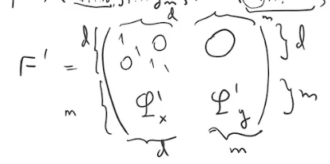
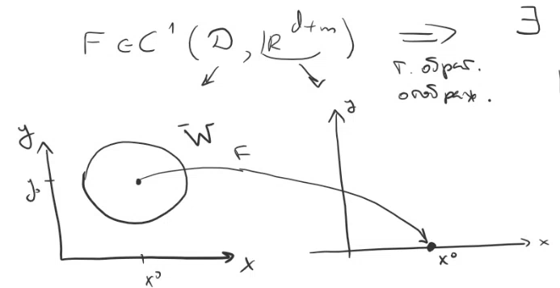
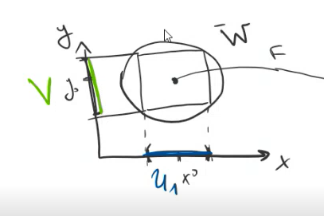

---  
layout: mathjax  
---  
  
# 69. Теорема о неявном отображении.  
  
### Вступление:  
Рассмотрим функцию $F(x,y)=0$.  
Если возможно выразить $y=f(x)$, то говорят, что $F(x,y)=0$ неявно задаёт $f(x)$.  
  
### Пример для одномерного случая:  
Пусть $F(x,y)=x-y^2=0\lrArr y(x)=\pm\sqrt x$.  
Предположим, что $F$ дифференцируема в $(x^0,y^0):$  
$\underbrace{F(x^0+\varDelta x,y^0+\varDelta y)}_{=0}=\underbrace{F(x^0,y^0)}_{=0}+F'_x(x^0,y^0)\varDelta x+$  
  
$+F'_y(x^0,y^0)\varDelta y+o(\varDelta x,\varDelta y)$.  
  
Тогда получим, что $F'_x(x^0,y^0)\varDelta x+F'_y(x^0,y^0)\varDelta y\thickapprox0$.  
  
Пусть $\varDelta y=y-y_0,~\varDelta x=x-x_0$.  
Если $F'_y(x^0,y^0)\neq0,$ то $\displaystyle y\thickapprox y_0-\frac{F'_x(x^0,y^0)}{F'_y(x^0,y^0)}(x-x_0)~-~$уравнение касательной.  
$F'_y(x,y)=(x-y^2)'_y=-2y=0\lrArr y=0$.  
  
### Рассмотрим многомерный случай:  
 $\begin{cases}  
\Phi_1(x_1\dots x_d,y_1\dots y_m)=0\\  
\dots\\  
\Phi_m(x_1\dots x_d,y_1\dots y_m)=0  
\end{cases}\xLeftrightarrow{?}\begin{cases}  
y_1=\phi_1(x_1\dots x_d)\\  
\dots\\  
y_m=\phi_m(x_1\dots x_d)  
\end{cases}$  
  
Мы задаёмся вопросом: можно ли явно выразить $y_i$ через $x_i$?  
Вообще переменные $x_i$ и $y_i$ равносильны. Мы дали им различные имена для удобства.  
  
Для краткости обозначим систему выше $\Phi(x,y)=0_m\xLeftrightarrow{?} y=\phi(x)$.  
Тогда $\Phi$ можно рассматривать как $\Phi:D\subset \mathbb{R}^{d+m}\to\mathbb{R}^m$.  
Возьмем точку $a=(x^0,y^0)\in\mathbb{R}^{d+m}$.  
Рассмотрим матрицу Якоби $\Phi'\in L(l_2^{d+m},l_2^m):$  
$\Phi'=\begin{pmatrix}  
(\Phi_1)'_{x_1}&\dots&(\Phi_1)'_{x_d}&(\Phi_1)'_{y_1}&\dots&(\Phi_1)'_{y_m}  
\\  
&\dots&&&\dots&  
\\  
(\Phi_m)'_{x_1}&\dots&(\Phi_m)'_{x_d}&(\Phi_m)'_{y_1}&\dots&(\Phi_m)'_{y_m}  
\end{pmatrix}=\Big(\Phi'_x,\Phi'_y\Big)$.  
  
$\Phi'_x(a)h=\Phi'(a)(h,0_m),~h\in\mathbb{R}^d$.  
$\Phi'_y(a)k=\Phi'(a)(0_d,k),~k\in\mathbb{R}^m$.  
  
### Теорема. Теорема о неявном отображении.  
$D$ открытое в $\mathbb{R}^{d+m}$ и $\Phi\in C^1(D,\mathbb{R}^m)$.  
Пусть $\Phi(x^0,y^0)=0_m$, где $(x^0,y^0)\in D$ и $\det\Phi'_y(x^0,y^0)\neq0$  
Тогда $\exists$ окрестности $U,V$ точек $x^0$ и $y^0$, такие, что:  
$1)~\forall x\in U ~~ \exists!y\in V ~~ \Phi(x,y)=0_m$  
Другими словами, определено отображение:  
$\phi:U\to V:~\phi(x)=y\lrArr\Phi(x,y)=0_m$  
$2)~\phi\in C^1(U,V)$  
$3)~\phi'(x)=-(\Phi'_y(x,y))^{-1}\cdot\Phi'_x(x,y) ~~ \forall x\in U$  
  
### Доказательство:  
Рассмотрим вспомогательное отображение $F:D\subset\mathbb{R}^{d+m}\to\mathbb{R}^{d+m}$.  
$F:(x,y)\mapsto\big(x,\Phi(x,y)\big)$  
Рассмотрим якобиан $F':$  
  
  
  
### $\det F'=\det E_d\cdot\det\Phi'_y=\det \Phi'_y$.  
Тогда из условия $\det F'(x^0,y^0)=\det\Phi'_y(x^0,y^0)\neq0$, а значит $F'(x^0,y^0)$ обратимо.  
  
Понятно, что $F\in C^1(D,\mathbb{R}^{d+m})$, так как все её координатные функции гладкие: $x_i\in C^\infty$, а $\Phi_i\in C^1$ по условию.  
Тогда по [теореме об обратном отображении](69 Теорема о неявном отображении/67 Теорема об обратном отображении) $\exists W=B_r(x^0,y^0)~-~$шар в $\mathbb{R}^{d+m}$, для которого $F|_W$ обратимо.  
  
### $F(x^0,y^0)=(x^0,0_m)$ следует из условия $\Phi(x^0,y^0)=0_m$.  
  
  
  
### Определим $U_1=B_{\frac{r}{\sqrt2} }(x^0)$ и $V=B_{\frac{r}{\sqrt2} }(y^0)$.  
  
  
  
### Покажем, что $U_1\times V\subset W=B_r(x^0,y^0):$  
Возьмём $x\in U_1,y\in V$ и рассмотрим расстояние до $(x^0,y^0)$.  
 $\displaystyle |(x,y)-(x^0,y^0)|=(\underbrace{\sum_{j=1}^{d}(x_j-x^0_j)^2}_{<\frac{r^2}{2} }+\underbrace{\sum_{j=1}^{m}(y_j-y^0_j)^2}_{<\frac{r^2}{2} })^\frac{1}{2}<r$  
Тогда понятно, что $(x,y)\in W$, а значит $U_1\times V\subset W$.  
  
Обозначим $W_1:=F(U_1\times V)$  
Так как $U_1\times V~-~$открыто (привет, топология произведения), то из [следствия](69 Теорема о неявном отображении/68 Открытое отображение Следствие об открытом отоб) получим, что $W_1$ открыто.  
  
### Подробнее о том, почему $W_1$ открыто.  
  
### Рассмотрим $F|_W\in C^1$. Вспомним, что $W$ открыто. Тогда нам не хватает обратимости $F'$ в каждой точке $W$, чтобы воспользоваться следствием об открытом отображении.  
Обратимся к [доказательству](69 Теорема о неявном отображении/67 Теорема об обратном отображении) теоремы об обратном отображении. В начале $3-4)$ мы показали, что $\forall x\in W ~~ F'(x)$ будет обратимым по [теореме об обратимости оператора близкого к обратимому](69 Теорема о неявном отображении/63 Обратимый оператор Обратимость оператора близк), к неравенству для которой мы вышли через непрерывность $F'$.  
Тогда $F|_W~-~$открытое отображение, а значит $F(U_1\times V)=W_1$ будет открытым.  
  
### Так как $W_1$ открыто и $(x^0,0_m)\in W_1$, то $\exists$ $($окрестность точки $(x^0,0_m))\subset W_1$.  
Обозначим $\big($окрестность точки $(x^0,0_m)\big)\cap\mathbb{R}^{d}=U~-~$окрестность $x^0$.  
  
Доказательство самих пунктов:  
$1)$ Пусть $x\in U\Rightarrow(x,0_m)\in W_1=F(U_1\times V)$.  
Тогда $F^{-1}(x,0_m)\in U_1\times V\Rightarrow \exists y\in V:\Phi(x,y)=0_m$  
Докажем единственность $y$. Для этого предположим противное.  
Пусть $\exists\overline{y}\in V:\Phi(x,\overline{y})=0_m$.  
Тогда $(x,y),(x,\overline{y})\in W$ и $F(x,y)=(x,0_m)=F(x,\overline{y})$.  
Мы знаем, что $F|_W$ обратима, а значит $(x,y)=(x,\overline{y})\Rightarrow y=\overline{y} ~~ \tiny\blacksquare$  
  
$2)$ $\phi:x\overset{Q}{\to}(x,0_m)\overset{F^{-1} }{\to}(x,y)\overset{P}{\to}y$.  
Получается, что $\phi=P\circ F^{-1}\circ Q$, где $Q,P$ линейны $\Rightarrow Q,P\in C^{\infty}$.  
При этом $F^{-1}$ по теореме об обратном отображении $\in C^1\Rightarrow\phi\in C^1 ~~ \tiny\blacksquare$  
  
$3)$ $\Phi(x,\phi(x))=0_m$, продифференцируем:  
$\Phi'_x(x,\phi(x))+\Phi'_y(x,\phi(x))\cdot\phi'(x)=0_{m\times d}$  
$\Phi'_y\cdot\phi'=-\Phi'_x\Rightarrow \phi'=-(\Phi_y')^{-1}\cdot\Phi_x ~~ \tiny\blacksquare$  
  
### Пример:  
Условие теоремы не является необходимым.  
$\Phi(x,y)=(x-y)^2=0,~\Phi_x=2(x-y),~\Phi_y=-2(x-y)\Rightarrow\Phi\in C^1(\mathbb{R}^2) ~~ \Phi'_y(x,y)=0\lrArr x=y~-~$теорема не применима, но уравнение имеет единственное решение $y(x)=x.$  
  
### Пример применения теоремы.  
$\Phi:\mathbb{R}^n\to\mathbb{R}^2\\\Phi:\begin{cases}  
\Phi_1(x,y,u,v)=u^2-2xv+y^2-1=0\\  
\Phi_2(x,y,u,v)=v^2-2yu+x^2=0  
\end{cases}$  
Можно ли решить систему $2$ переменными в окрестности какой-либо точки? $M(0,1,0,0)~-~$точка.  
$\Phi'|_M=\begin{pmatrix}  
(\Phi_1)'_x&(\Phi_1)'_y&(\Phi_1)'_u&(\Phi_1)'_v\\  
(\Phi_2)'_x&(\Phi_2)'_y&(\Phi_2)'_u&(\Phi_2)'_v  
\end{pmatrix}|_M=\begin{pmatrix}  
-2v&2y&2u&-2x\\  
2x&-2u&-2y&2v  
\end{pmatrix}|_M=\begin{pmatrix}  
0&2&0&0\\  
0&0&-2&0  
\end{pmatrix}$,  
$\Phi'_{(y,u)}=\begin{pmatrix}  
2&0\\  
0&-2  
\end{pmatrix}$.  
$\Phi=0_2\lrArr\begin{cases}  
y=\phi_1(x,v)\\  
u=\phi_2(x,v)  
\end{cases}$  
$\displaystyle\phi'=\begin{pmatrix}  
y'_x&y'_v\\  
u'_x&u'_v  
\end{pmatrix}=-\begin{pmatrix}  
(\Phi_1)'_y&(\Phi_1)'_u\\  
(\Phi_2)'_y&(\Phi_2)'_u  
\end{pmatrix}^{-1}\cdot\begin{pmatrix}  
(\Phi_1)'_x&(\Phi_1)'_v\\  
(\Phi_2)'_x&(\Phi_2)'_v  
\end{pmatrix}=\frac{1}{u^2-y^2}\begin{pmatrix}  
-y&-u\\  
u&y  
\end{pmatrix}\begin{pmatrix}  
-v&-x\\  
x&v  
\end{pmatrix}$  
