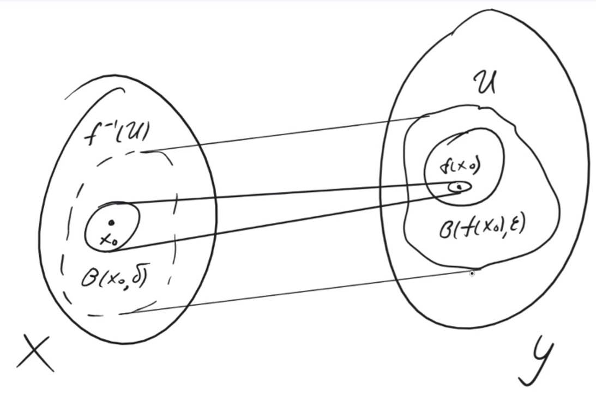
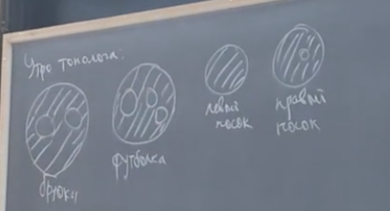

---  
layout: mathjax  
---  
  
# 04.03.24  
  
### Определение. Непрерывность в топологическом пространстве.  
$(X,\Omega_X),(Y,\Omega_Y)~-~$топологические пространства,  
$f:X\to Y~-~$отображение.  
Тогда $f$ называется непрерывным, если $\forall U\in\Omega_Y ~~ f^{-1}(U)\in\Omega_X$.  
  
### Теорема. Критерий непрерывности функции.  
$(X,\rho),(Y,d)~-~$метрические пространства, $f:X\to Y~-~$непрерывна  
(пространства метрические, так как в топологических “прообраз открытого открыт” является определением непрерывного отображения).  
$f$ непрерывна $\Leftrightarrow$ прообраз $\forall$ открытого $U$ открыт.  
  
### Доказательство:  
$\Rightarrow:$  
Пусть $U~-~$открытое в $Y$. Докажем, что $f^{-1}(U)~-~$открыто в $X$.  
Возьмём произвольный $x_0\in f^{-1}(U)$, тогда по определению прообраза  
$f(x_0) \in U$ $\Rightarrow$ $\exists \varepsilon > 0$: $B_Y(f(x_0), \varepsilon) \subset U$  
Для полученного $\varepsilon$ применим определение непрерывности:  
$\exists \delta = \delta(\varepsilon, x_0) > 0$: $f(B_X(x_0, \delta) ) \subset B_Y(f(x_0), \varepsilon) \subset U$  
$B_X(x_0, \delta) \subset f^{-1}(U) ~~ \tiny\blacksquare$  
  
### Картинка  
  
  
  
### $\Leftarrow$:  
Берем произвольный $x_0 \in X$ и произвольный $\varepsilon > 0$.  
Соорудим открытое множество, чтобы воспользоваться условием:  
$U:=B_Y(f(x_0), \varepsilon)$. Тогда $f^{-1}(U)$  открыто, и $x_0 \in f^{-1} (U)$.  
Из открытости следует, что $\exists \delta(x_0,\varepsilon) > 0:B_X(x_0, \delta) \subset f^{-1}(U)$ .  
Но $f^{-1}(U)=f^{-1} (B_Y(f(x_0), \varepsilon))\Rightarrow f(B_X(x_0, \delta)) \subset B_Y(f(x_0), \varepsilon)$.  
  
### Определение. Гомеоморфизм.  
$(X, \Omega_{X}), (Y, \Omega_{Y})~-~$топологические пространства.  
$f:X\to Y~-~$гомеоморфизм, если:  
$1)$ $f$ непрерывна  
$2)$ $f$ биективна  
$3)$ $f^{-1}$ непрерывна  
  
### Обозначение.  
$\cong$  - вот так его обозначают  
  
### Примеры разрывных обратных отображений:  
$1)$ $f [0, 2\pi] \Rightarrow S^1$  
$S^1 = \\{ (x, y) \in \mathbb{R}^2 : x^2 + y^2 = 1\\} = \\{z \in \mathbb{C} : |z| = 1\\}$  
$f(\alpha) =\cos(\alpha) + i\sin(\alpha)$  $-$ непрерывно и биективно  
  
$f^{-1}~-~$ разрывно  
  
$2)$ $(X; \Omega_1),(X, \Omega_2)~-~$топологические пространства и $\Omega_2 \subsetneqq \Omega_1$  
В таком случае говорят, что $\Omega_1 -$  это более сильная (тонкая) топология, чем $\Omega_2$.  
Заведем отображение: $f:X \Rightarrow X$, где $x \mapsto x$.  
Тогда $f(U)=U$.  
Очевидно, $f~-~$непрерывна, так как $\Omega_2\subsetneqq\Omega_1$, но $f^{-1}$ не обязательно непрерывна, так как $\Omega_1\not\subset\Omega_2$.  
  
### Частные примеры на $\mathbb{R}$:  
$\Omega_1 -$ дискретная  
$\Omega_2 -$ антидискретная  
$\Omega_3 -$ стандартная  
$\Omega_4 -$ Зарисского  
$\Omega_5 -$ стрелка  
  
$\begin{cases} \Omega_2 \subset \Omega_4 \subset \Omega_3\subset\Omega_1  
\\  
\Omega_2 \subset \Omega_5 \subset \Omega_3\subset\Omega_1  
\end{cases}$  
  
### Замечание.  
$f : X \Rightarrow Y$ на $X$  дискретна $\Rightarrow$ $f$  непрерывна  
$f: X \Rightarrow Y$  на $Y$антидискретна $\Rightarrow$ $f$ непрерывна  
  
### Определение.  
$X$  и  $Y$ гомеоморфны, если $\exists$ гомеоморфизм $f: X \Rightarrow Y$  
  
### Примеры:  
1) Гомеоморфизм между отрезками  
 $(a, b) \cong (c, d)$  
  
$f(x) = \dfrac {d - c} {b - a} (x - a) + c$  
(гомеоморфизм - любое непрерывное строго возрастающее отображение, у которого $f(a) = c$, $f(b) = d$)  
  
2) $(a, b) \cong \mathbb{R}$, то есть любой интервал гомеоморфен множеству вещественных чисел, например ($-\pi/2, \pi/2)\cong \mathbb{R}$ (по сути $\tg$)  
  
### Утверждение. Гомеоморфизм это эквивалентность.  
  
### Доказательство:  
Рефлексивность. $X \cong X$ $f(x) = x$, так как тождественное отображение  
  
Симметричность. $f: X \Rightarrow Y$ гомеоморфизм $\Rightarrow$ $f^{-1} : Y \Rightarrow X$ - тоже гомеоморфизм просто по определению  
  
Транзитивность. $f: X \Rightarrow Y$, $g: Y \Rightarrow Z$ гомеоморфизм $\Rightarrow$ $g \circ f: X \Rightarrow Z$ тоже гомеоморфизм.  
  
### Определение. Топологической свойство.  
Свойство топологического пространства называется топологическим, если оно не меняется при гомеоморфизме.  
Например, свойство “любое подмножество открытое”. Оно означает, что топология на пространстве дискретная.  
  
### Замечание. При гомеоморфизме происходит биекция топологий.  
  
  
  
### Кто понял, тот понял  
